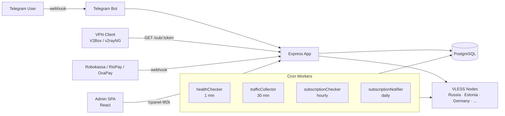

# Rocky VPN — Master Backend

Бэкенд VPN-сервиса с подпиской: Telegram-бот для пользователей, REST-админка, кластер из VLESS-нод, интеграции с тремя платёжными провайдерами. Работает в проде, обслуживает живых юзеров и платежи.

**Стек:** Node.js · Express 5 · PostgreSQL · Sequelize · node-cron · Docker · Telegram Bot API · React (админ-панель)

---

## Что внутри

- **Telegram-бот** — регистрация, выбор языка (ru/en), оформление подписки, рефералка, выдача VPN-конфига.
- **Балансировщик нагрузки** — `/sub/:token` отдаёт VLESS-конфиг с наименее загруженной живой ноды.
- **Health-checker нод** — раз в минуту опрашивает кластер, кеширует состояние, исключает мёртвые ноды из балансировки.
- **Traffic collector** — собирает трафик с нод каждые 30 минут, режет доступ при превышении лимита, защищает от шейринга по числу сокетов.
- **Платёжные интеграции** — Robokassa (РФ), RioPay (₸/UZS), OxaPay (крипто). Унифицированный webhook-флоу.
- **Admin-панель** — SPA на React по секретному пути, управление нодами, пользователями, подписками, просмотр платежей.
- **Промо-рассылки** — сегментные кампании по бывшим/неактивным юзерам с защитой от rate-limit Telegram.

---

## Архитектура



---

## Структура

```
src/
├── server.js               # entrypoint: запуск Express + всех воркеров
├── app.js                  # сборка приложения, middleware, роуты
├── bot.js                  # Telegram-бот, обёртка над node-telegram-bot-api
├── commands/               # хендлеры команд бота (/start, /subscribe, ...)
├── routes/
│   ├── subRouter.js        # GET /sub/:token — выдача VLESS клиенту
│   ├── adminNodesRouter.js # CRUD нод
│   ├── adminUsersRouter.js # CRUD юзеров
│   ├── nodeSyncRouter.js   # синхронизация state с нод
│   ├── oxaPayWebhook.js    # крипто-платежи
│   ├── rioPayWebhook.js    # ₸/UZS
│   └── robokassaWebhook.js # ₽
├── workers/
│   ├── healthChecker.js          # пинг нод + кеш
│   ├── trafficCollector.js       # сбор трафика + анти-шейринг
│   ├── subscriptionChecker.js    # отключение по истечении срока/лимита
│   ├── subscriptionNotifier.js   # уведомления "осталось 3/1 день"
│   └── promoNotifier.js          # сегментные промо-рассылки
├── middleware/
│   ├── rateLimiter.js      # лимит /sub, /admin, /bot
│   └── ipWhitelist.js      # whitelist для админ-API и node-API
├── services/               # бизнес-логика (платежи, активация подписок)
└── utils/                  # i18n, флаги стран, генерация uuid

db/
├── models/                 # Sequelize: User, Node, Plan, Subscription, Payment, ...
├── migrations/
└── seeders/

admin-panel/                # React SPA, билдится в public/admin
```

---

## Ключевые механики

### Балансировка по нагрузке нод

`/sub/:token` — клиент VPN дёргает раз в час. Логика выбора ноды:

1. Фильтр: убираем ноды с `user_count >= max_users`.
2. Сортировка по `active_connections` (берём минимум).
3. Fallback: если все полные — берём с минимумом коннектов.
4. Fallback: кеш пуст (первый запуск) — случайная нода.

Кеш состояния нод обновляется воркером `healthChecker` раз в минуту, при балансировке к нодам не ходим.

### Анти-шейринг по числу сокетов

`trafficCollector` суммирует активные коннекты юзера по всем нодам. Если > `MAX_CONNECTIONS_PER_USER` (256) — авто-троттл на всём кластере, флаг `throttled=true`. Когда коннекты падают и трафик в норме — авто-разморозка. Цикл каждые 30 минут.

### Платёжные провайдеры

Три webhook-эндпоинта, общий контракт:
- верификация подписи провайдера (HMAC / sign)
- идемпотентность по `provider_payment_id`
- атомарная транзакция: `Payment.create` + продление/создание `Subscription`
- ответ строго в формате, который провайдер ждёт (иначе ретрай)

### Сегментные промо-рассылки

`promoNotifier` шлёт по cron трём сегментам:
- **С1** — истёкший триал, не платили
- **С2** — бывшие платящие без активной подписки
- **С3** — нет ни одной подписки

Защита от Telegram rate-limit: пауза 50мс между сообщениями + 1с каждые 100, обработка 429 с `retry_after`, тихий пропуск 403 (бот заблокирован).

### Локализация

Все тексты бота через `src/utils/i18n.js`, словари в `src/locales/{ru,en}.json`. Язык хранится в `User.lang`, выбирается при `/start`.

### Безопасность

- `helmet` + `cors`
- IP-whitelist для `/api/admin/*` и `/api/nodes/*` (`middleware/ipWhitelist.js`)
- Rate-limit на `/sub`, `/api/admin`, `/bot{token}` (`express-rate-limit`)
- Webhook'и платёжек верифицируют подпись на сыром body (`req.rawBody`)
- Админ-панель по секретному пути `/cpanel-9f2k`
- `.env` для всех секретов, `.env.example` в репо

---

## Запуск локально

**Требования:** Node.js 20+, PostgreSQL 14+, Telegram bot token.

```bash
git clone <repo>
cd v-flux-master
cp .env.example .env          # заполнить TELEGRAM_BOT_TOKEN, DB_*, DOMAIN
npm install
npm run db                    # drop + create + migrate + seed
npm run dev                   # nodemon src/server.js
```

Полезные скрипты:

```bash
npm run db:migrate            # только миграции
npm run db:seed               # только сиды
npm run db:reset              # сбросить и накатить заново
npm run lint                  # eslint
```

Webhook Telegram требует HTTPS — для локальной разработки прокидываем через ngrok / cloudflared.

---

## Деплой

Прод крутится в Docker за nginx с TLS. Сборка:

```bash
docker build -t v-flux-master .
docker run -d --env-file .env -p 3000:3000 v-flux-master
```

База — отдельный PostgreSQL-инстанс. Воркеры стартуют вместе с приложением в `src/server.js`.

---

## Технические заметки

- **Express 5** — wildcard роуты через `{*path}`, не `/*` или `:path*`.
- **Sequelize** — модели в `db/models/`, ассоциации через `static associate(models)`.
- **node-cron** — воркеры пишут расписание сами в своём модуле, регистрируются в `server.js`.
- **VLESS** — формат `vless://uuid@domain:443?type=ws&security=tls&path=%2Fws&encryption=none&mux=off#tag`, base64 в ответе `/sub/:token`.
